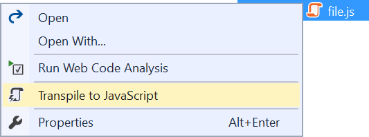

# JavaScript Transpiler

Download this extension from the [Marketplace](https://marketplace.visualstudio.com/items?itemName=MadsKristensen.JavaScriptTranspiler)
or get the [CI build](http://vsixgallery.com/extension/d6330ef4-ab82-4ab1-9828-4e43639e7521/).

---------------------------------------

The simplest way to transpile JS and JSX to EcmaScript 5 without any complicated node.js tools in your project. It uses the TypeScript compiler behind the scenes.

See the [change log](CHANGELOG.md) for changes and road map.

**Note!** This extension only works on the latest version of Visual Studio 2017 for ASP.NET Core projects.

## Content

- Enable transpilation
- Options
- Transpile on save
- Troubleshoot

### Enable transpilation
In order for the automatic transpiling to happen, a `tsconfig.json` file must be located in the same directory as the script file or in any parent directory above it.

This extension makes it easy to get started by placing a command on the context menu of .js and .jsx files in Solution Explorer.

The `tsconfig.json` file created looks like this:

This command is only available if no tsconfig.json file is found.

### Options
Since this extension uses the TypeScript compiler under the hood,
all options set in the `tsconfig.json` is honored when transpiling.

You can set options under the `"compilerOptions"` element. Just remember to set `"allowJs"` to `true` for the TypeScript compiler to pick up `.js` and `.jsx` files.

### Transpile on save
When the `tsconfig.json` file is set up correctly, then transpilation happens automatically every time you save one of the source `.js` or `.jsx` files.

### Troubleshooting
If the compilation doesn't work, the first thing to try is to build the ASP.NET Core project. That triggers the built-in TypeScript compiler. 

If the output `.js` file is not being generated then it is becuase the `tsconfig.json` isn't set up correctly. Make sure both `"compileOnSave"` `"compilerOptions/allowJs"` is set to `true` and that `"include"` or `"files"` point to the source file.

If it works on project build, then it should work when saving source files too.

## Contribute
Check out the [contribution guidelines](.github/CONTRIBUTING.md)
if you want to contribute to this project.

For cloning and building this project yourself, make sure
to install the
[Extensibility Tools 2015](https://visualstudiogallery.msdn.microsoft.com/ab39a092-1343-46e2-b0f1-6a3f91155aa6)
extension for Visual Studio which enables some features
used by this project.

## License
[Apache 2.0](LICENSE)